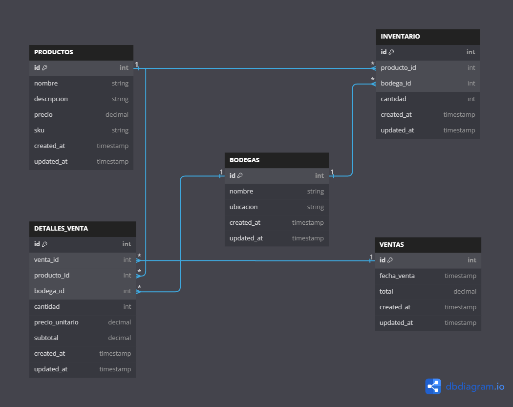

# Apuntes
para hacer uso de Postgres como base de datos use Docker para crear la coneccion a la base de datos,
para poder levantar Docker usamos:
```
docker-compose up -d
```
accedemos a la interfaz de pgadmin y creamos la base de datos: inventory_db

para que la aplicaion funcione debemos crear un archivo .env donde incluimos las variables de entorno de ejemplo que estan en el archivo .env.example

### Modelado de datos


## 1. Tabla PRODUCTOS:

- Es la tabla central que almacena la información de todos los productos.
- Campos principales: id (clave primaria), nombre, descripción, sku, precio.
- Relaciones:

- Un producto puede estar en múltiples registros de INVENTARIO (relación uno a muchos).
- Un producto puede aparecer en múltiples DETALLES_VENTA (relación uno a muchos).

## 2. Tabla BODEGAS:

- Almacena información sobre las diferentes bodegas o ubicaciones de almacenamiento.
- Campos principales: id (clave primaria), nombre, ubicación.
- Relaciones:

- Una bodega puede tener múltiples registros en INVENTARIO (relación uno a muchos).
- Una bodega puede estar asociada a múltiples DETALLES_VENTA (relación uno a muchos).

## 3. Tabla INVENTARIO:

- Es una tabla de unión que relaciona PRODUCTOS y BODEGAS, representando el stock de cada producto en cada bodega.
- Campos principales: id (clave primaria), producto_id (clave foránea), bodega_id (clave foránea), cantidad.
- Relaciones:

- Cada registro se relaciona con un PRODUCTO específico (relación muchos a uno).
- Cada registro se relaciona con una BODEGA específica (relación muchos a uno).


- La combinación de producto_id y bodega_id es única (constraint UNIQUE).


## 4. Tabla VENTAS:

- Registra las transacciones de venta principales.
- Campos principales: id (clave primaria), fecha_venta, total.
- Relaciones:

- Una venta puede tener múltiples DETALLES_VENTA (relación uno a muchos).

## 5. Tabla DETALLES_VENTA:

- Almacena los detalles específicos de cada producto vendido en una venta.
- Campos principales: id (clave primaria), venta_id (clave foránea), producto_id (clave foránea), bodega_id (clave foránea), cantidad, precio_unitario, subtotal.
- Relaciones:

- Cada detalle se relaciona con una VENTA específica (relación muchos a uno).
- Cada detalle se relaciona con un PRODUCTO específico (relación muchos a uno).
- Cada detalle se relaciona con una BODEGA específica (relación muchos a uno).

Relaciones y Lógica de Negocio:

1. Productos y Inventario:

- Cada producto puede tener múltiples registros en el inventario, uno por cada bodega donde se almacena.
- Esto permite rastrear la cantidad de cada producto en diferentes ubicaciones.

2. Bodegas e Inventario:

- Cada bodega puede almacenar múltiples productos.
- La tabla INVENTARIO actúa como una tabla de unión entre PRODUCTOS y BODEGAS.

3. Ventas y Detalles de Venta:

- Cada venta se desglosa en uno o más detalles de venta.
- Los detalles de venta permiten registrar qué productos específicos se vendieron, en qué cantidad y desde qué bodega.

4. Productos, Bodegas y Detalles de Venta:

- Cada detalle de venta está asociado a un producto específico y a la bodega desde donde se vendió.
- Esto permite un seguimiento preciso del inventario y facilita la generación de informes detallados.

Integridad Referencial:

- Las claves foráneas (FK) en INVENTARIO y DETALLES_VENTA aseguran que solo se puedan ingresar datos válidos que existan en las tablas relacionadas.
- Por ejemplo, no se puede agregar un detalle de venta para un producto que no existe en la tabla PRODUCTOS.

Consideraciones de Diseño:

1. Normalización: El esquema está normalizado para reducir la redundancia de datos y mejorar la integridad.
2. Flexibilidad: La estructura permite manejar múltiples bodegas y un seguimiento detallado del inventario.
3. Trazabilidad: Se pueden rastrear las ventas hasta el nivel de producto y bodega específicos.
4. Timestamps: Todas las tablas incluyen campos created_at y updated_at para el seguimiento temporal de los registros.